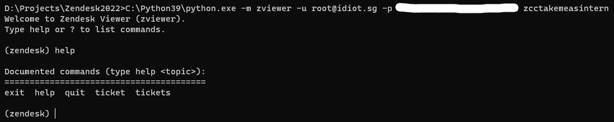
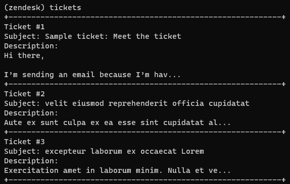
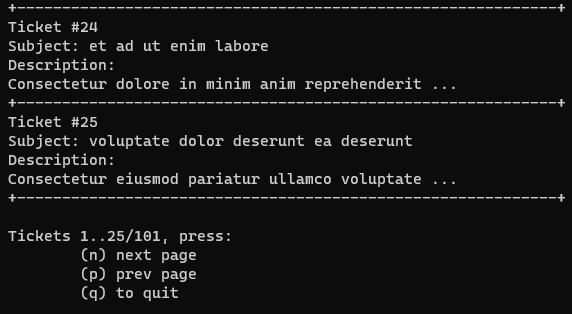
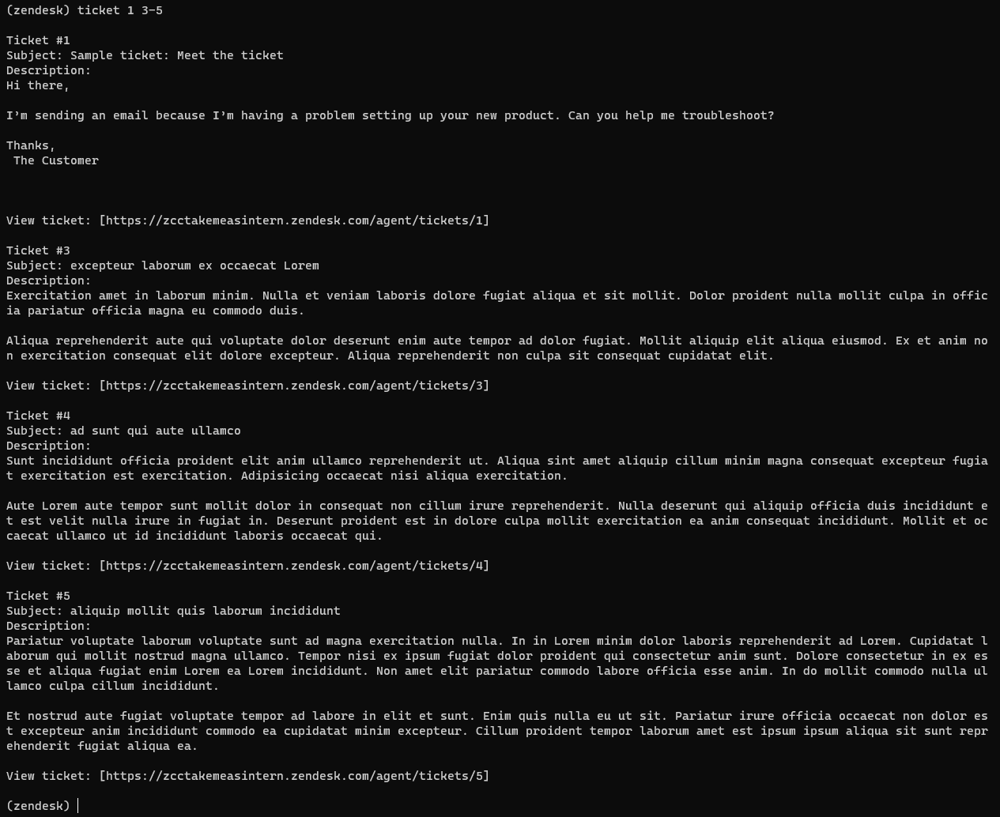
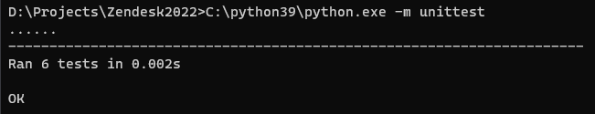

# Zendesk2022

## Overview

CLI application that allows viewing and listing of tickets from a **Zendesk** workspace.

### Features

- CLI interface
- Preview of all tickets
- Displaying custom set of tickets

### Demo

#### CLI usage



#### Ticket listing/preview




#### Ticket viewing



#### Testing



## Usage Instructions

### Requirements

```bash
pip install -r requirements.txt
```

Currently only requires `requests` package.

Requires Python3.5+ (due to usage of type hints).

Tested on Python3.9 (Windows), Python3.8 (Linux).

### Shell usage

To run the shell, first enter the directory where this repository is stored locally.

In bash or cmd:

```bash
python3 -m zviewer -u USERNAME -p PASSWORD SUBDOMAIN
```

- **USERNAME** is your Zendesk account username
- **PASSWORD** is your Zendesk account password
- **SUBDOMAIN** is the subdomain OR full URL for your Zendesk workspace

Upon running, the credentials will be tested to ensure they are valid for the workspace in use.

After entering the `zviewer` shell, it should allow you to perform the functionality simply.

### Listing tickets

```
(zendesk) tickets
+------------------------------------------------------------+
Ticket #1
Subject: Sample ticket: Meet the ticket
Description:
...
```

### Ticket details

```
(zendesk) ticket 2

Ticket #2
Subject: velit eiusmod reprehenderit officia cupidatat
Description:
Aute ex sunt culpa ex ea esse sint cupidatat aliqua ex consequat sit reprehenderit. Velit labore proident quis culpa ad duis adipisicing laboris voluptate velit incididunt minim consequat nulla. Laboris adipisicing reprehenderit minim tempor officia ullamco occaecat ut laborum.

Aliquip velit adipisicing exercitation irure aliqua qui. Commodo eu laborum cillum nostrud eu. Mollit duis qui non ea deserunt est est et officia ut excepteur Lorem pariatur deserunt.

View ticket: [https://zcctakemeasintern.zendesk.com/agent/tickets/2]

(zendesk) ticket 3-5

Ticket #3
Subject: excepteur laborum ex occaecat Lorem
Description:
Exercitation amet in laborum minim. Nulla et veniam laboris dolore fugiat aliqua et sit mollit. Dolor proident nulla mollit culpa in officia pariatur officia magna eu commodo duis.

Aliqua reprehenderit aute qui voluptate dolor deserunt enim aute tempor ad dolor fugiat. Mollit aliquip elit aliqua eiusmod. Ex et anim non exercitation consequat elit dolore excepteur. Aliqua reprehenderit non culpa sit consequat cupidatat elit.

View ticket: [https://zcctakemeasintern.zendesk.com/agent/tickets/3]

Ticket #4
Subject: ad sunt qui aute ullamco
Description:
Sunt incididunt officia proident elit anim ullamco reprehenderit ut. Aliqua sint amet aliquip cillum minim magna consequat excepteur fugiat exercitation est exercitation. Adipisicing occaecat nisi aliqua exercitation.

Aute Lorem aute tempor sunt mollit dolor in consequat non cillum irure reprehenderit. Nulla deserunt qui aliquip officia duis incididunt et est velit nulla irure in fugiat in. Deserunt proident est in dolore culpa mollit exercitation ea anim consequat incididunt. Mollit et occaecat ullamco ut id incididunt laboris occaecat qui.

View ticket: [https://zcctakemeasintern.zendesk.com/agent/tickets/4]

Ticket #5
Subject: aliquip mollit quis laborum incididunt
Description:
Pariatur voluptate laborum voluptate sunt ad magna exercitation nulla. In in Lorem minim dolor laboris reprehenderit ad Lorem. Cupidatat laborum qui mollit nostrud magna ullamco. Tempor nisi ex ipsum fugiat dolor proident qui consectetur anim sunt. Dolore consectetur in ex esse et aliqua fugiat enim Lorem ea Lorem incididunt. Non amet elit pariatur commodo labore officia esse anim. In do mollit commodo nulla ullamco culpa cillum incididunt.

Et nostrud aute fugiat voluptate tempor ad labore in elit et sunt. Enim quis nulla eu ut sit. Pariatur irure officia occaecat non dolor est excepteur anim incididunt commodo ea cupidatat minim excepteur. Cillum proident tempor laborum amet est ipsum ipsum aliqua sit sunt reprehenderit fugiat aliqua ea.

View ticket: [https://zcctakemeasintern.zendesk.com/agent/tickets/5]
```

### Testing

From this repository's directory:

```
$ python3 -m unittest
......
----------------------------------------------------------------------
Ran 6 tests in 0.003s

OK
```